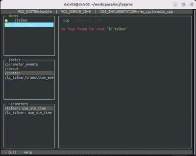

# lazyros

A simple and friendly terminal UI for ROS2.
> Note: Supports **ROS 2 Humble and Jazzy**.




## Features
- View and manage node list and states (with Lifecycle support)
- Inspect topics, services, and parameters
- Built-in log/echo viewer with highlighting and search
- Fast keyboard-driven navigation

## Requirements
- Ubuntu 20.04+ + ROS 2 Humble/Jazzy
- Python 3.8+
- Dependencies: `rclpy`, `textual`, `rich`, etc.


## Installation

- pipx (recommended)
  ```shell
  pipx install lazyros
  ```

- pip
  ````shell
  pip install lazyros
  ````
  
- from source
  
  ```shell
  git clone https://github.com/TechMagicKK/lazyros.git
  cd lazyros
  pip install -r requirements.txt
  ```

## Usage

```shell
# For ROS 2 Humble
source /opt/ros/humble/setup.bash
lazyros

# For ROS 2 Jazzy
source /opt/ros/jazzy/setup.bash
lazyros
```

## Getting started

1. Run talker demo node
   ```shell
   ros2 run demo_nodes_cpp talker
   ```

2. Run listener demo node
   ```
   ros2 run demo_nodes_cpp listener
   ```

3. Run lazyros
   ```shell
   lazyros
   ```

## Configuration

You can tell lazyros to ignore specific nodes, topics, or parameters by creating a file:
```sh
~/.config/lazyros/ignore.yaml
```
If this file doesn’t exist, lazyros will just run normally.

Example:
```bash
nodes:
  - /lazyros*
topics:
  - /parameter_events
parameters:
  - /lazyros*
```


## Help

- Trouble
  If you encounter trouble, please feel free to open an issue!

- Request

  Any request is welcome, please feel free to request in issue!


## Release

Check [How to release](./docs/release.md).
